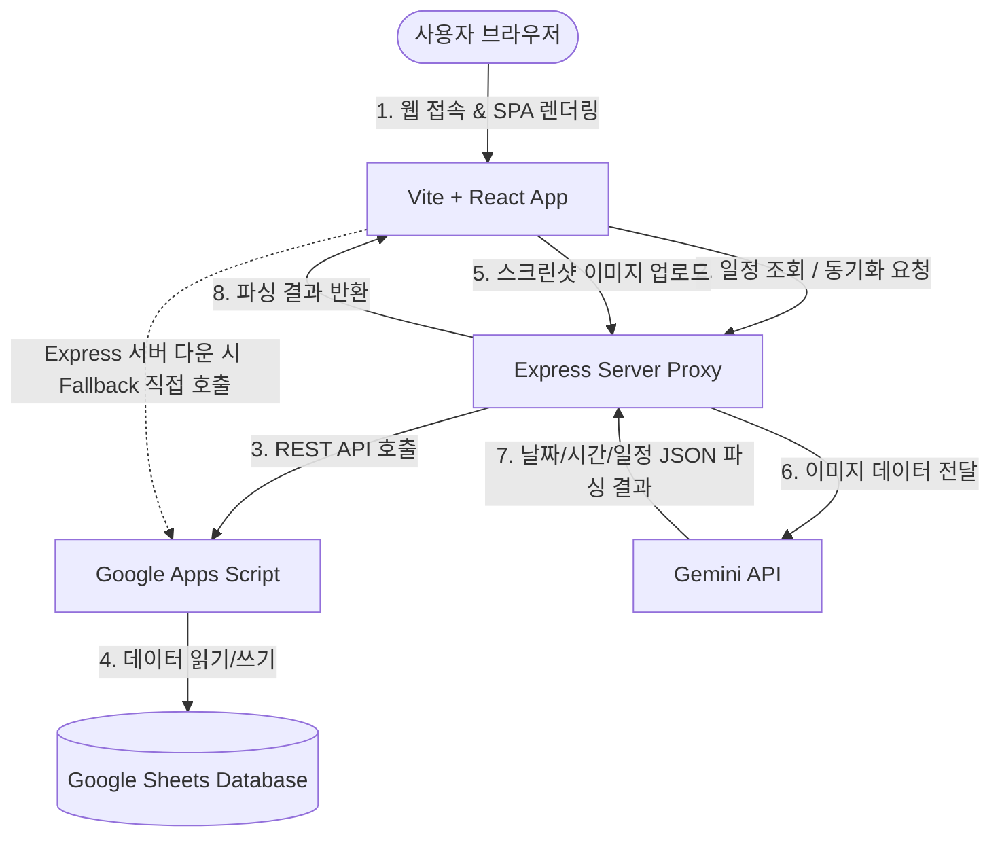

# Product Requirement Document (PRD): 프다갤 벙 일정 관리 서비스

본 문서는 디시인사이드 프리다이빙 갤러리(이하 '프다갤')의 다이빙 모임(벙) 일정을 관리하고 공유하기 위한 **'프다갤 벙 일정'** 서비스의 제품 요구사항 정의서(PRD)입니다.

---

## 1. 서비스 개요
* **서비스명**: 프다갤 벙 일정 (Freediving Gallery Gathering Planner)
* **슬로건/갤훈**: 발사대 학대금지 🌊
* **한 줄 정의**: 프다갤 이용자들이 전국 주요 딥다이빙 풀장(성남, 수원, 딥스 등)에서 진행하는 프리다이빙 벙 일정을 한눈에 확인하고, 쉽게 등록 및 공유할 수 있는 캘린더 기반 웹 애플리케이션입니다.

### 1.1 배경 및 목적
* **기존 문제점**: 디시인사이드 게시판을 통해 번개 모임(벙)을 모집할 경우, 글이 빠르게 묻혀 일정을 한눈에 파악하기 어렵고 참가자 관리가 번거로웠습니다.
* **해결 방안**: 캘린더 인터페이스를 통해 일자별, 장소별 벙 일정을 시각화하고, 참가 신청 및 변경 상태를 실시간으로 반영하여 소통 비용을 최소화합니다.

---

## 2. 타겟 사용자 (Target Users)
1. **벙 개설자 (주최자)**: 특정 날짜와 시간에 다이빙 풀장 벙을 주최하고 동행할 버디를 모집하려는 사용자.
2. **벙 참가자**: 자신이 갈 수 있는 일정과 장소(풀장)의 벙을 탐색하고 참가 신청을 하려는 사용자.
3. **갤러리 눈팅족/정보 탐색자**: 현재 진행 예정인 벙 현황을 빠르게 확인하려는 사용자.

---

## 3. 핵심 기능 요구사항 (Functional Requirements)

### 3.1 캘린더 뷰 및 필터 (Calendar View & Filters)
* **월별/일별 캘린더 뷰**: 
  * 사용자는 달력 형태로 특정 월의 전체 벙 스케줄을 한눈에 볼 수 있어야 합니다.
  * 이전 달 및 다음 달 이동 기능이 제공되어야 합니다.
* **장소(풀장)별 필터링**:
  * 주요 딥다이빙 풀장 기준의 필터 버튼을 제공합니다.
  * 지원 장소: **딥스(DIPS), 성남(아쿠라인), 파라(파라다이스), 수원(수원월드컵), 자유일정** 등
  * 특정 장소를 선택하면 해당 장소의 벙만 캘린더와 리스트에 필터링되어 표시됩니다.
* **참석자 검색 기능**:
  * 참석자의 이름을 입력하여 해당 인원이 참여하는 벙 일정을 검색할 수 있습니다.
  * 편의성을 위해 마지막 검색어가 브라우저 로컬 스토리지(`localStorage`)에 저장 및 자동 복구됩니다.

### 3.2 일정 생성 및 상세 관리 (Event Creation & Details)
* **일정 등록 및 수정 폼 (EventForm)**:
  * 입력 항목: 제목, 시작일, 종료일(선택), 시작 시간(선택), 종료 시간(선택), 장소, 상세 설명, 참석자 명단, 딥탱크 이용시간 정보.
  * 딥탱크 이용시간의 경우 '전반부', '후반부' 등의 옵션을 지원합니다.
* **일정 상세 정보 모달 (EventDetailModal)**:
  * 캘린더나 리스트에서 일정을 클릭 시 상세 내역(참석자 목록, 딥탱크 정보, 메모 등)이 노출됩니다.
  * 참가자는 상세 모달에서 직접 본인의 이름을 추가/삭제하여 참가 의사를 표시할 수 있습니다.
* **삭제 로직 (Soft-Delete)**:
  * 일정 삭제 시 데이터를 데이터베이스에서 물리적으로 지우는 대신, 참석자 명단에 `삭제됨` 텍스트를 추가하는 방식으로 소프트 삭제(Soft-delete) 처리합니다.

### 3.3 실시간 데이터 동기화 (Google Sheet & GAS Integration)
* **백엔드 프록시 및 GAS 연동**:
  * 구글 스프레드시트를 데이터베이스로 활용하며, Google Apps Script (GAS) 웹 앱 API를 통해 데이터를 조회 및 갱신합니다.
  * Express 서버(`/api/schedules` 엔드포인트)가 프록시 역할을 수행하여 안전하고 빠른 동기화를 지원합니다.
  * 만약 Express 프록시 서버에 접근할 수 없는 환경(예: Vercel 등 클라이언트 온리 배포)인 경우, 클라이언트 브라우저가 직접 GAS Web App URL로 직접 통신(Fallback)하도록 이중화 설계를 적용합니다.
* **동기화 상태 시각화**:
  * 데이터 동기화 진행 중에는 바다 관련 이모지(`🌊, 🏊, 🐬, 🐳, 🐋, 🦈, 🐙` 등)가 무작위로 변경되며 애니메이션 효과와 함께 로딩 화면이 노출됩니다.
  * 우측 상단에 동기화 상태 표시 배지(Live / Sync... / Error)를 두어 사용자가 신뢰도를 직관적으로 파악할 수 있도록 합니다.

### 3.4 AI 일정 스캔 (AI Screenshot Parser - 이스터 에그)
* **진입 경로**: 캘린더 뷰 내 '오늘' 버튼을 **3회 연속 클릭** 시 히든 기능으로 'AI 일정 스캔 모달'이 열립니다.
* **기능 상세**:
  * 사용자가 모바일 캘린더나 일정 공유 텍스트 스크린샷 이미지를 업로드합니다.
  * Express 서버의 `/api/analyze-screenshot` API를 호출하고, 내부적으로 **Gemini API**(`gemini-3.5-flash` 등)를 연동하여 이미지 내의 날짜, 시간, 일정 제목, 상세 정보를 JSON 형태로 추출합니다.
  * 파싱된 데이터를 기반으로 자동으로 여러 개의 일정을 즉시 캘린더 데이터베이스에 추가 및 등록합니다.
  * 파싱 연도는 기획에 따라 기본적으로 `2026년`을 기준으로 자동 보정합니다.

### 3.5 딥링크 (Deep Linking)
* **공유 링크 지원**:
  * 특정 일정을 클릭하여 상세 모달이 열리면 브라우저 주소 표시줄의 URL에 쿼리 스트링(`?scheduleId=이벤트ID`)이 자동으로 부여됩니다.
  * 이 URL을 복사하여 다른 사람에게 전달할 경우, 페이지 최초 접속 시 해당 일정의 연월로 캘린더가 자동 이동하고, 상세 모달이 팝업으로 노출됩니다.

### 3.6 PWA (Progressive Web App) 지원
* **설치 지원**:
  * 모바일 및 PC 브라우저에서 '앱 설치(다운로드)' 버튼을 통해 바로 가기 앱 형태로 홈 화면에 추가할 수 있는 PWA 기능을 제공합니다.

---

## 4. 비기능 요구사항 (Non-Functional Requirements)

### 4.1 UI/UX 및 디자인 에스테틱
* **컨셉**: 레트로/네오브루탈리즘 느낌의 캐주얼하고 톡톡 튀는 **'팝 캔디(Candy)'** 디자인.
* **컬러 팔레트**: 
  * 메인 배경색: 따뜻한 베이지 계열 (`#FFFDF5`) 및 점박이 그리드 패턴 (`dot-grid`)
  * 포인트 색상: 생동감 있는 보라색 (`#8B5CF6`), 경쾌한 노란색 (`#FBBF24`), 분홍색 (`#F472B6`)
  * 테두리 및 텍스트: 강렬하고 명확한 어두운 남색 계열 (`#1E293B`)
* **인터랙션**:
  * 버튼 클릭 시 누르는 듯한 입체감을 주는 그림자 오프셋 애니메이션 (`shadow-pop`, `btn-candy`).
  * 모달 팝업 시 자연스러운 줌-인 바운스 효과 (`animate-pop-in`).

### 4.2 안정성 및 보안
* **API Key 보안**: Gemini API Key 및 백엔드 주요 설정값은 클라이언트에 노출하지 않고 서버의 환경 변수(`.env.local`)로 안전하게 관리합니다.
* **에러 복구**: 구글 스프레드시트 조회나 저장 오류 발생 시 사용자에게 명확하게 에러 토스트(Toast) 메시지를 표시하고, 재동도 가능하도록 유도합니다.

---

## 5. 데이터 모델 (Data Model)

### 5.1 ScheduleEvent 인터페이스 (Typescript)
```typescript
export interface ScheduleEvent {
  id: string;              // 고유 ID (구글 시트 행 번호 또는 UUID 형태)
  title: string;           // 벙 제목 (예: "성남 2시 벙")
  date: string;            // 일정 시작일 (YYYY-MM-DD 포맷)
  endDate?: string | null; // 일정 종료일 (다중일정용, YYYY-MM-DD 포맷)
  startTime: string | null;// 시작 시간 (HH:MM 또는 "1부" 등 자유 텍스트)
  endTime: string | null;  // 종료 시간 (HH:MM)
  description: string | null; // 벙 설명 및 메모
  createdAt: string;       // 생성 일시 (ISO String)
  location?: string | null; // 장소 (딥스, 성남, 파라, 수원, 자유일정)
  attendees?: string | null; // 참가자 이름 목록 (쉼표로 구분된 문자열)
  deepTankUsage?: string | null; // 딥탱크 이용시간 ("전반부", "후반부" 등)
}
```

### 5.2 Google Sheets 저장 구조
스프레드시트는 아래의 헤더 명칭을 기준으로 열이 정렬되어 데이터를 저장합니다.
1. `ID` (A열)
2. `Title` (B열)
3. `Date` (C열)
4. `StartTime` (D열)
5. `EndTime` (E열)
6. `Description` (F열)
7. `CreatedAt` (G열)
8. `Location` (H열)
9. `Attendees` (I열)
10. `EndDate` (J열)
11. `DeepTankUsage` (K열)

---

## 6. 아키텍처 다이어그램 (Architecture)


